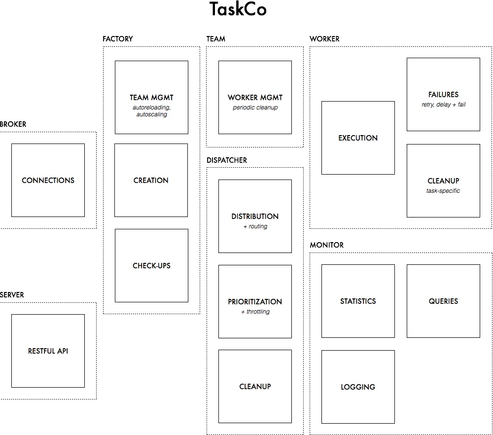

TaskCo
======


Distributed priority jobs queue for node.js

## Introduction

### Why another jobs queue for node?

This project started in search of a redis-backed jobs queue. While there are numerous options at the time of publishing,
each of these has its benefits/shortcomings. These are in NO way knocks against the projects, or against the authors, they
simply highlight why we are in need of another solution.

1. Kue (LearnBoost): the most mature, and certainly most beautiful queue around. Fast, and clean code base. However, the
repo has numerous pull pull requests outstanding, does not offer connection pooling, tends to have problems cleaning up
tasks, and operates a first-come-first-serve queue.

2. Kue (dfoody): updated with numerous quality-of-service features, it still suffers from lack of connection pooling, and
has not been shown to be compatible past node 0.6.x. To my knowledge, it also does full text indexing in the manner of
Kue (LearnBoost).

3. Convoy: Great work by GoSquared to prevent jammed jobs. Currently does not offer storing additional data (a necessity
for many).

4. Coffee-Resque: a great start in porting Github's own resque, however, the project appears to be not nearly as
fully-featured.


### TaskCo Goals

TaskCo was created with the following features in mind:

1. Extremely modular design: enables easier collaboration.
2. The ability to drop in a transport. Currently, Redis is the only supported transport.
3. Connection pooling.
4. Task-routing-friendly: while not currently implemented, the infrastructure was design with this in mind.
5. Easy input/output. Lots of convenience functions.
6. As much auto-cleanup as possible (frequent use of `expires`)
7. An extensive test suite (skeletoned out, but help needed)


### Eventual roadmap:




## Getting Started

### The quick way

While a TaskCo supports multiple factories, the root object has convenience accessors for the default factory. The
following example uses those methods.

```javascript

// ***** Process #1 (web client)
var TaskCo = require('taskco').setup();

// Create task
TaskCo.quickEntry('email', { name : 'hello@gmail.com' });


// **** Process #2 (worker)
var TaskCo = require('taskco').setup();

// A procedure must have a work function
var processEmail = {
  work: function(task, done) {
    console.log(task.data.name);
    done();
  }
}

// Add the team with concurrency of 3 workers and remove the job 5 seconds after completion/failure.
TaskCo.addProcedure('email', processEmail, { removeAfter : 5 }).andTeam(3);

```
